# Lista de Exercícios - Lógica de Programação

Aluna: Maria Eduarda Flores

---

# Parte 1 - Algoritmos sequenciais

## Exercício 1 - Saudação

**Entradas:** nome

**Processamento:** Nenhum cálculo, só junta o nome na mensagem.

**Saídas:** Mensagem de boas-vindas com o nome.

**Código:** [exercicio01.c](exercicio01.c)

**Fluxograma:**

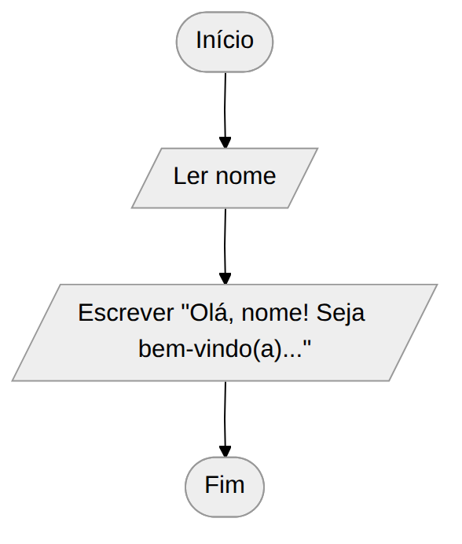

## Exercício 2 - Soma de dois números

**Entradas:** n1, n2 (inteiros)

**Processamento:** soma = n1 + n2

**Saídas:** n1, n2 e a soma

**Código:** [exercicio02.c](exercicio02.c)

**Fluxograma:**

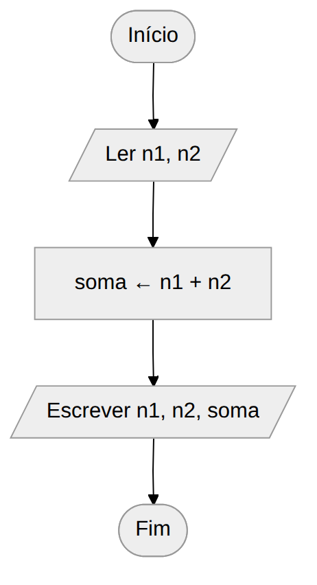

## Exercício 3 - Quatro operações

**Entradas:** n1, n2

**Processamento:** Soma, subtração, multiplicação e divisão de n1 por n2.

**Saídas:** Os quatro resultados

**Código:** [exercicio03.c](exercicio03.c)

**Fluxograma:**

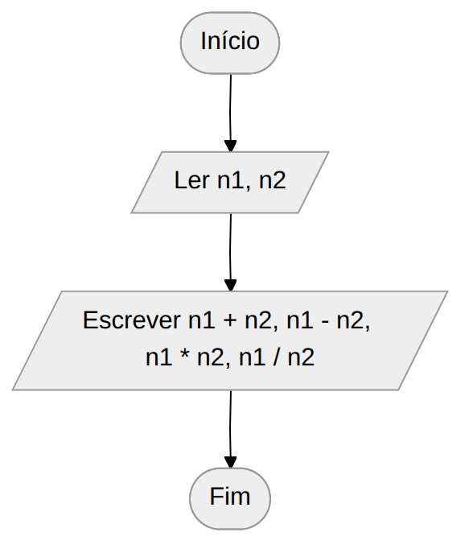

## Exercício 4 - Média do aluno

**Entradas:** n1, n2, n3

**Processamento:** media = (n1 + n2 + n3) / 3

**Saídas:** A média

**Código:** [exercicio04.c](exercicio04.c)

**Fluxograma:**

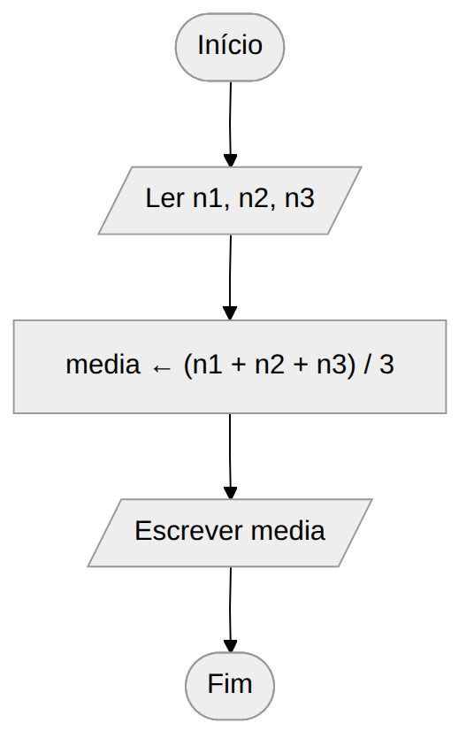

## Exercício 5 - Área do retângulo

**Entradas:** base, altura

**Processamento:** area = base * altura

**Saídas:** A área

**Código:** [exercicio05.c](exercicio05.c)

**Fluxograma:**

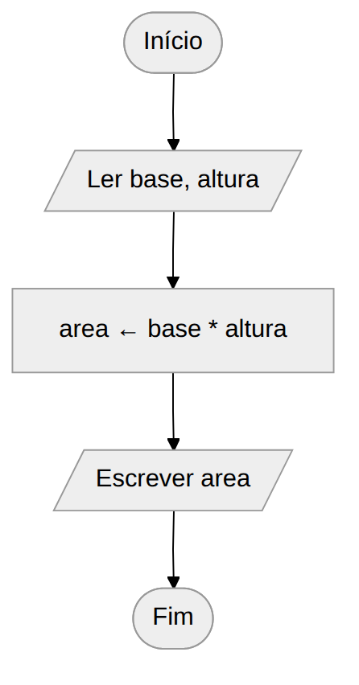

## Exercício 6 - Área do círculo

**Entradas:** raio

**Processamento:** area = 3.14159 * raio * raio

**Saídas:** A área

**Código:** [exercicio06.c](exercicio06.c)

**Fluxograma:**

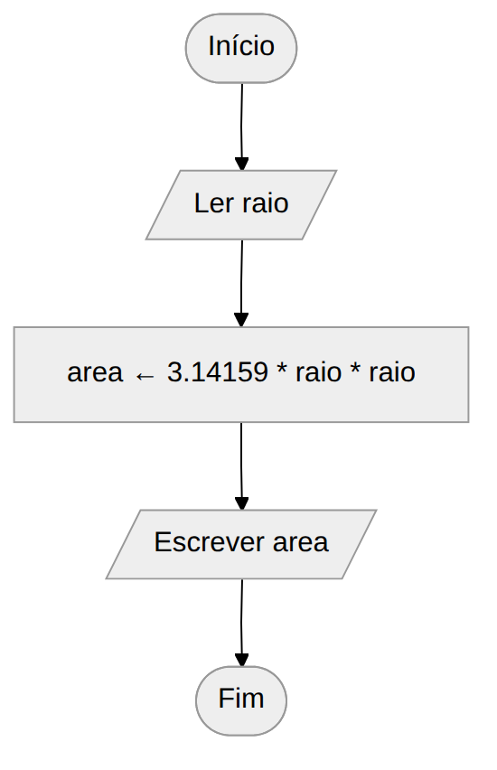

## Exercício 7 - Conversão de temperatura

**Entradas:** c (Celsius)

**Processamento:** f = (c * 9 / 5) + 32

**Saídas:** Temperatura em Fahrenheit

**Código:** [exercicio07.c](exercicio07.c)

**Fluxograma:**

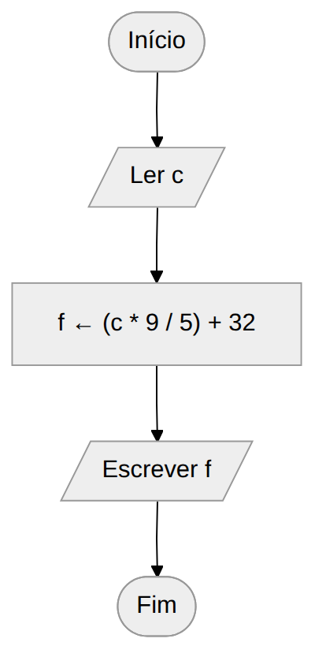

## Exercício 8 - Salário mensal

**Entradas:** horas, valorHora

**Processamento:** salario = horas * valorHora

**Saídas:** Salário bruto

**Código:** [exercicio08.c](exercicio08.c)

**Fluxograma:**

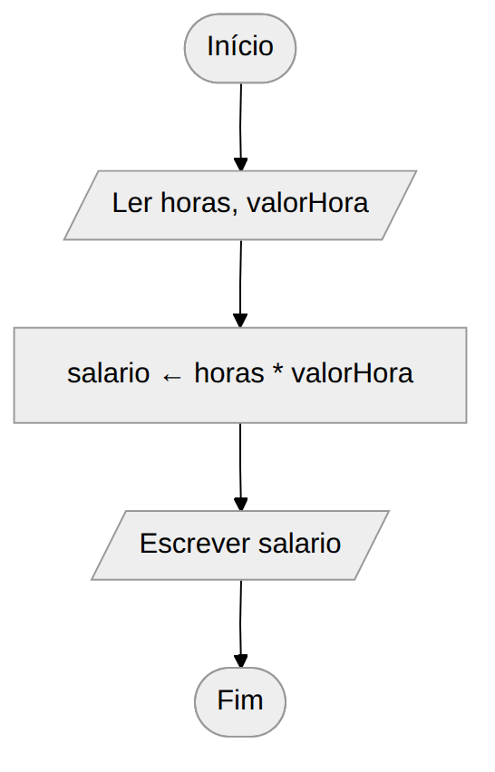

## Exercício 9 - Consumo de combustível

**Entradas:** km, litros

**Processamento:** consumo = km / litros

**Saídas:** Consumo em km/L

**Código:** [exercicio09.c](exercicio09.c)

**Fluxograma:**

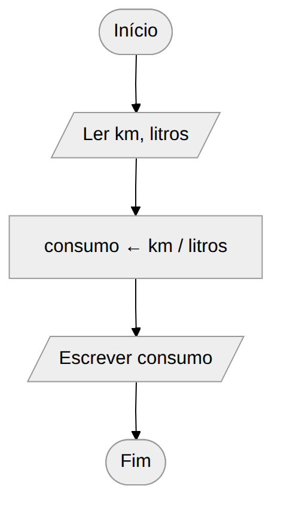

## Exercício 10 - Valor da compra

**Entradas:** produto, qtd, preco

**Processamento:** total = qtd * preco

**Saídas:** Produto e valor total

**Código:** [exercicio10.c](exercicio10.c)

**Fluxograma:**

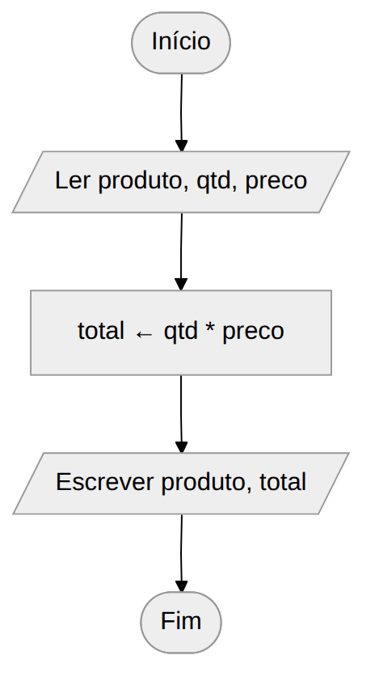

---

# Parte 2 - Estruturas condicionais

## Exercício 11 - Maior de idade

**Entradas:** idade

**Processamento:** Se idade >= 18 é maior, senão é menor.

**Saídas:** "Maior de idade" ou "Menor de idade"

**Código:** [exercicio11.c](exercicio11.c)

**Fluxograma:**

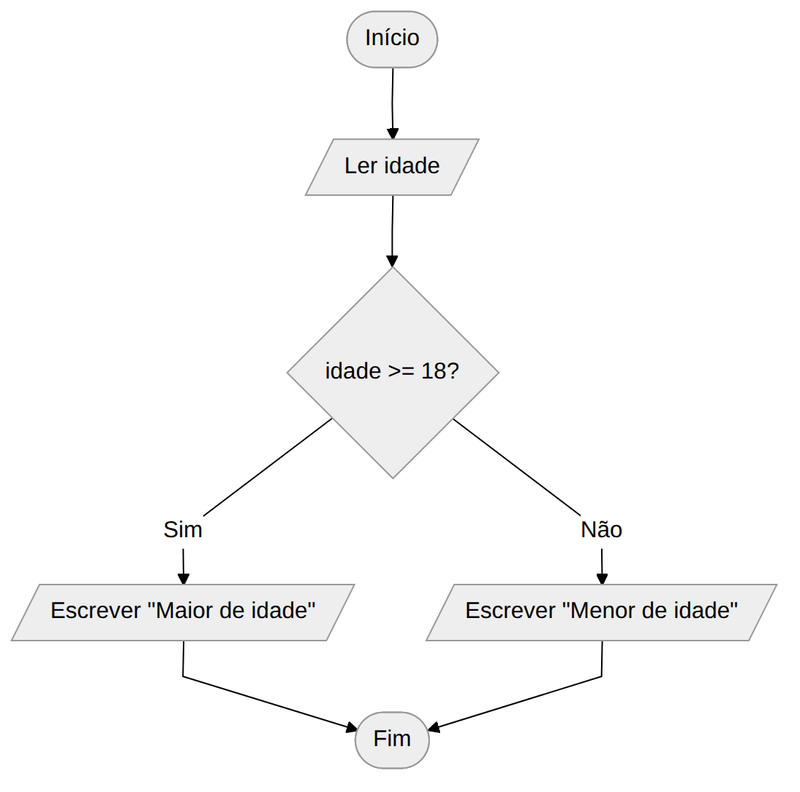

## Exercício 12 - Positivo ou negativo

**Entradas:** n

**Processamento:** Testa se n > 0, se n < 0, senão é zero.

**Saídas:** Positivo, negativo ou zero

**Código:** [exercicio12.c](exercicio12.c)

**Fluxograma:**

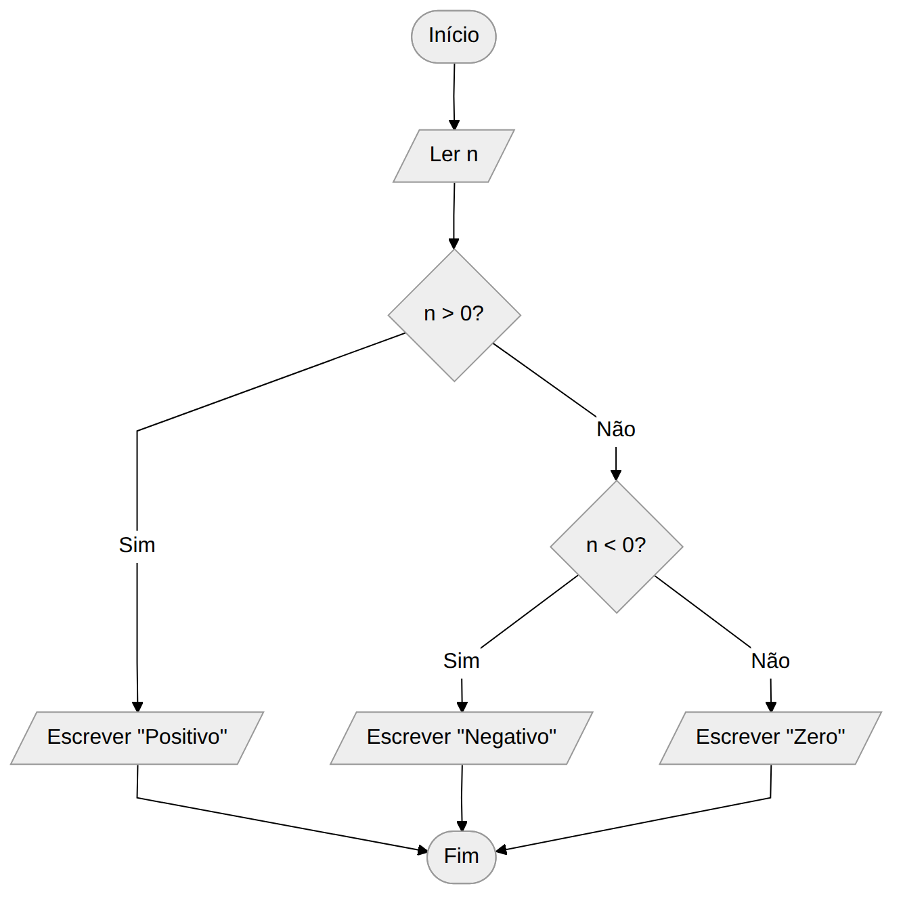

## Exercício 13 - Par ou ímpar

**Entradas:** n (inteiro)

**Processamento:** Se o resto de n / 2 for 0 (n % 2 == 0) é par.

**Saídas:** Par ou ímpar

**Código:** [exercicio13.c](exercicio13.c)

**Fluxograma:**

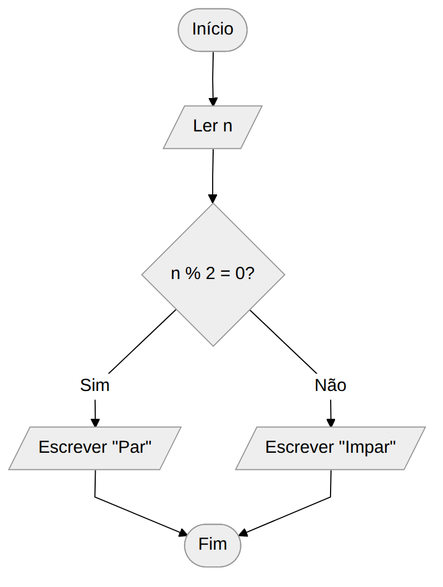

## Exercício 14 - Maior entre dois números

**Entradas:** n1, n2

**Processamento:** Compara n1 > n2.

**Saídas:** O maior número

**Código:** [exercicio14.c](exercicio14.c)

**Fluxograma:**

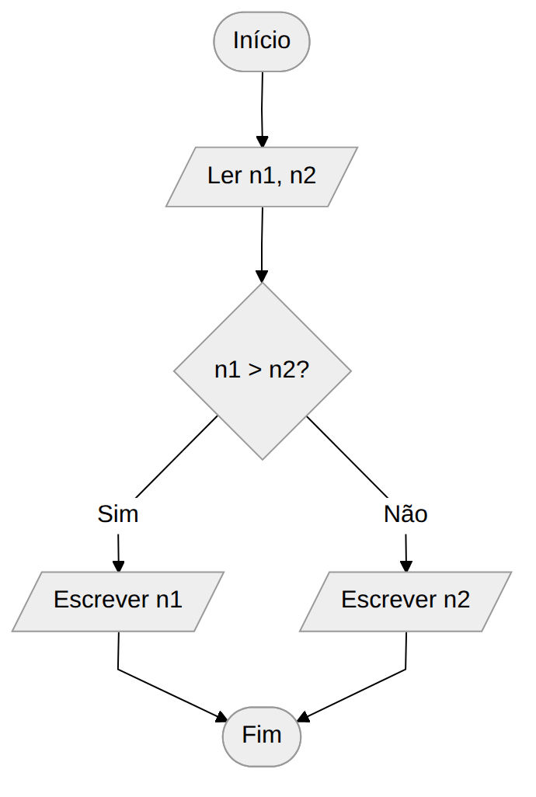

## Exercício 15 - Maior entre três números

**Entradas:** n1, n2, n3

**Processamento:** maior começa com n1; se n2 for maior troca, se n3 for maior troca.

**Saídas:** O maior número

**Código:** [exercicio15.c](exercicio15.c)

**Fluxograma:**

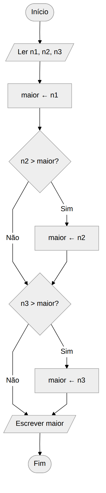

## Exercício 16 - Situação acadêmica

**Entradas:** n1, n2

**Processamento:** media = (n1 + n2) / 2. Média >= 7 aprovado, >= 5 recuperação, senão reprovado.

**Saídas:** Média e situação

**Código:** [exercicio16.c](exercicio16.c)

**Fluxograma:**

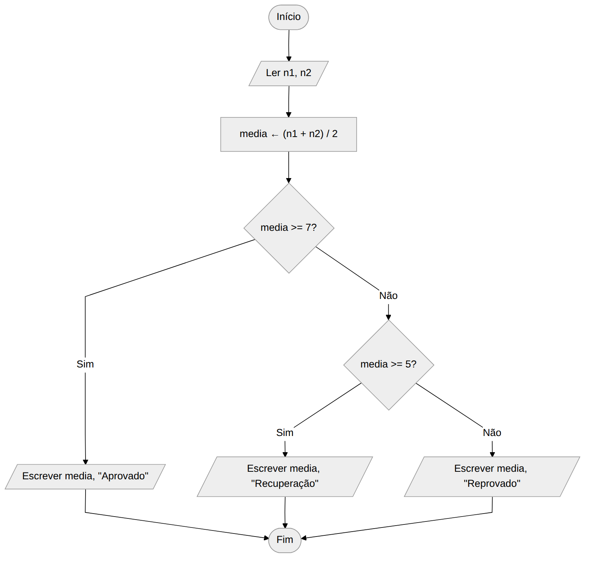

## Exercício 17 - Desconto na compra

**Entradas:** valor

**Processamento:** Até 100: 0%. Até 500: 5%. Acima de 500: 10%. desconto = valor * perc / 100 e final = valor - desconto.

**Saídas:** Valor original, percentual, desconto e valor final

**Código:** [exercicio17.c](exercicio17.c)

**Fluxograma:**

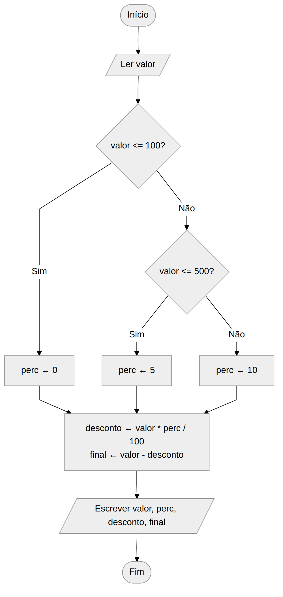

## Exercício 18 - Faixa etária

**Entradas:** idade

**Processamento:** Até 12 criança, até 17 adolescente, até 59 adulto, senão idoso.

**Saídas:** A faixa etária

**Código:** [exercicio18.c](exercicio18.c)

**Fluxograma:**

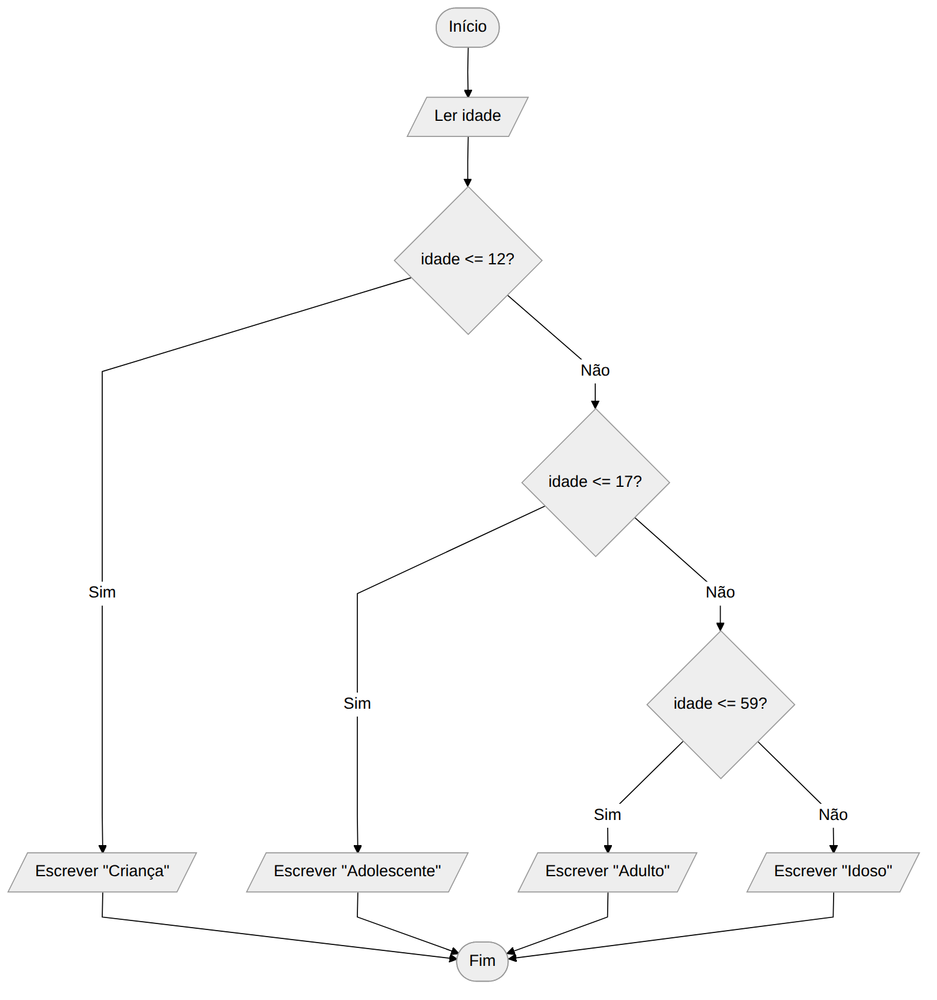

## Exercício 19 - Cálculo do IMC

**Entradas:** peso, altura

**Processamento:** imc = peso / (altura * altura). Menor que 18.5 abaixo do peso, menor que 25 adequado, menor que 30 sobrepeso, senão obesidade.

**Saídas:** IMC e classificação

**Código:** [exercicio19.c](exercicio19.c)

**Fluxograma:**

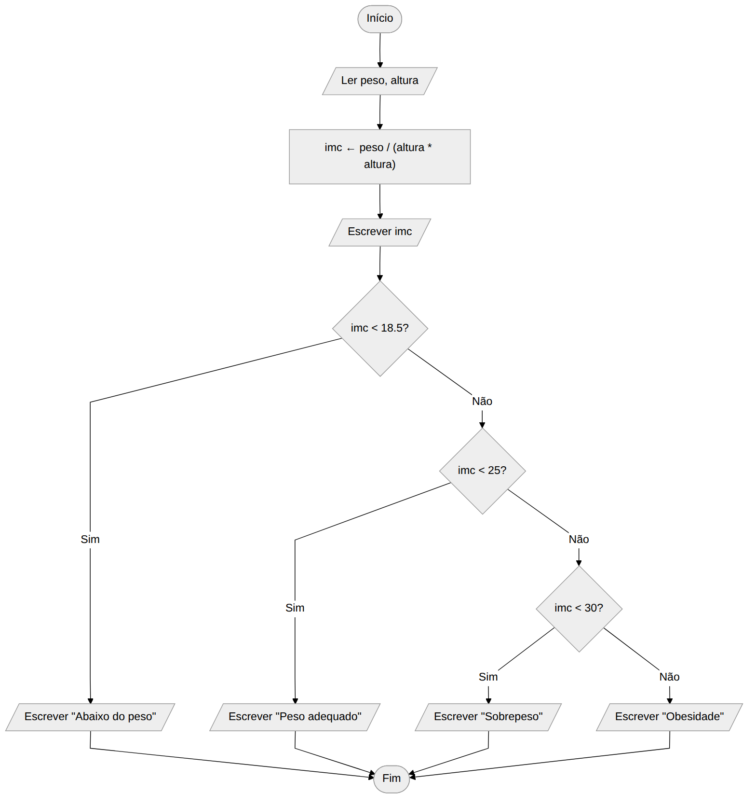

## Exercício 20 - Calculadora

**Entradas:** n1, n2, op (+ - * /)

**Processamento:** switch na operação. Na divisão testa se n2 é zero antes.

**Saídas:** Resultado ou mensagem de erro

**Código:** [exercicio20.c](exercicio20.c)

**Fluxograma:**

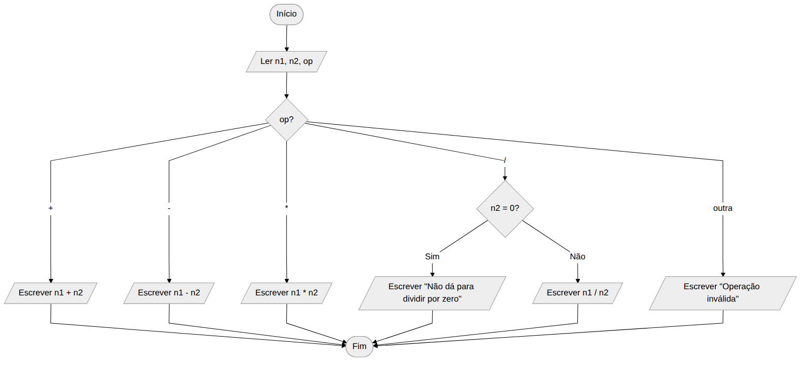

---

# Parte 3 - Estruturas de repetição

## Exercício 21 - Contagem crescente

**Entradas:** Nenhuma

**Processamento:** for de i = 1 até 10.

**Saídas:** 1 até 10

**Código:** [exercicio21.c](exercicio21.c)

**Fluxograma:**

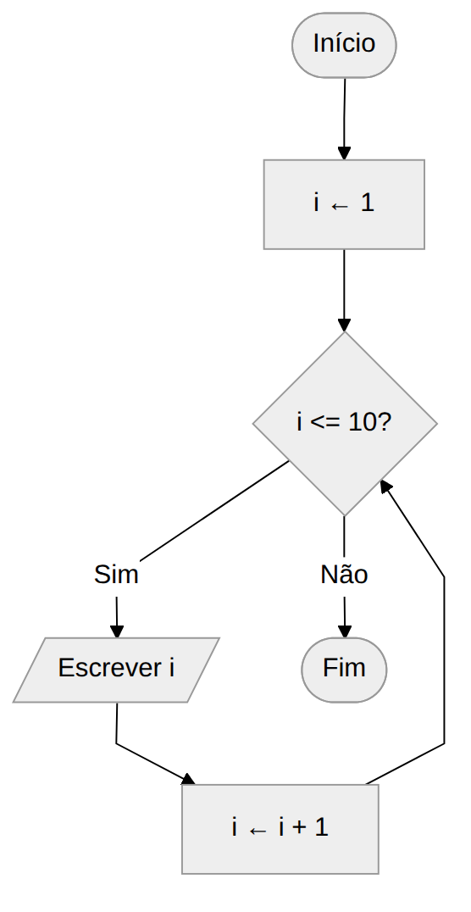

## Exercício 22 - Contagem regressiva

**Entradas:** Nenhuma

**Processamento:** for de i = 10 até 0, diminuindo.

**Saídas:** 10 até 0 e "Fim da contagem!"

**Código:** [exercicio22.c](exercicio22.c)

**Fluxograma:**

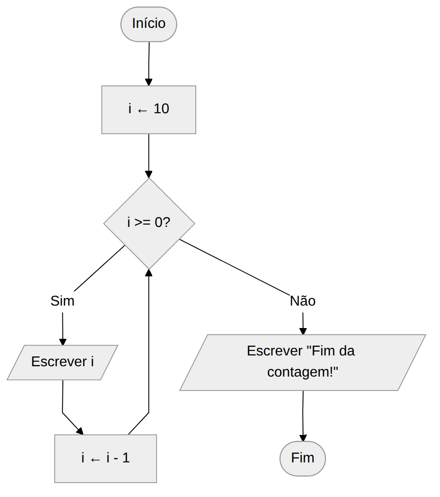

## Exercício 23 - Números pares

**Entradas:** Nenhuma

**Processamento:** for de 1 até 100 e if (i % 2 == 0).

**Saídas:** Os pares de 2 a 100

**Código:** [exercicio23.c](exercicio23.c)

**Fluxograma:**

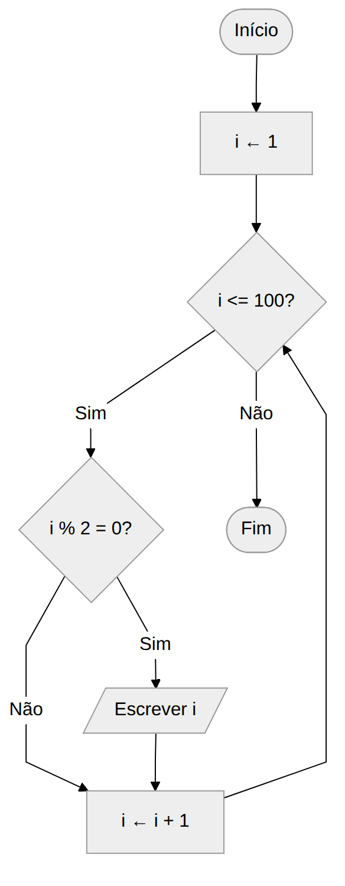

## Exercício 24 - Tabuada

**Entradas:** n

**Processamento:** for de i = 1 até 10 mostrando n * i.

**Saídas:** A tabuada de n

**Código:** [exercicio24.c](exercicio24.c)

**Fluxograma:**

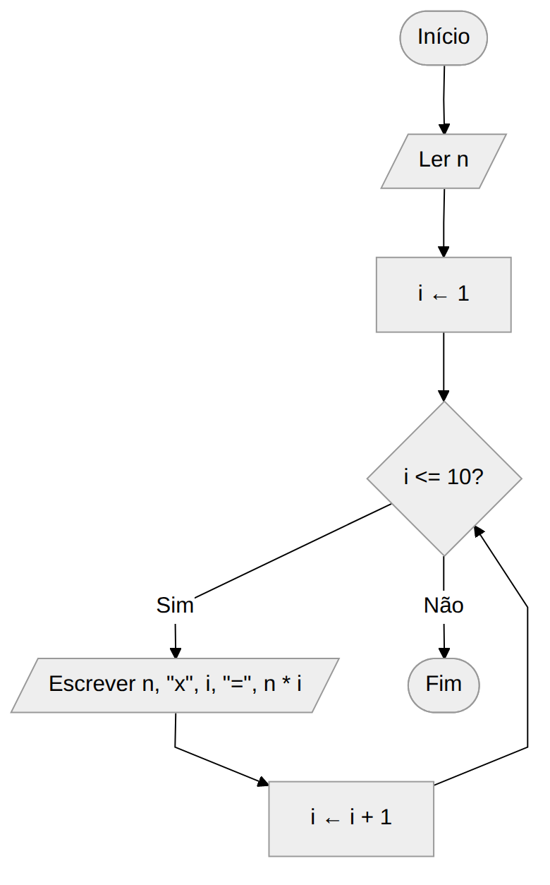

## Exercício 25 - Soma de 1 até N

**Entradas:** n

**Processamento:** soma começa em 0 e o for soma cada i de 1 até n.

**Saídas:** A soma

**Código:** [exercicio25.c](exercicio25.c)

**Fluxograma:**

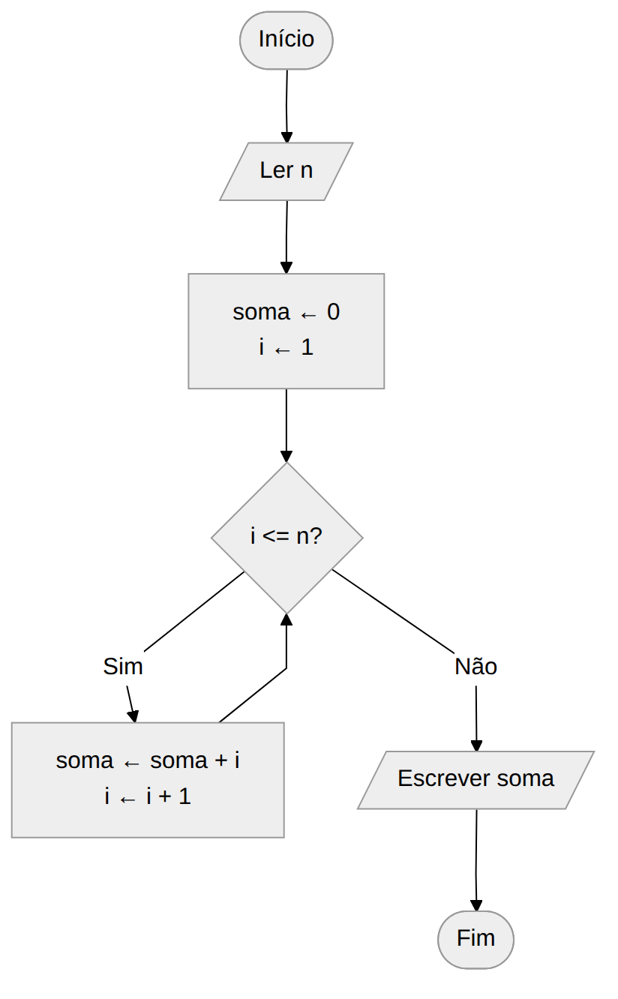

## Exercício 26 - Média da turma

**Entradas:** qtd, nota de cada aluno

**Processamento:** Soma as notas no for e depois media = soma / qtd.

**Saídas:** Média da turma

**Código:** [exercicio26.c](exercicio26.c)

**Fluxograma:**

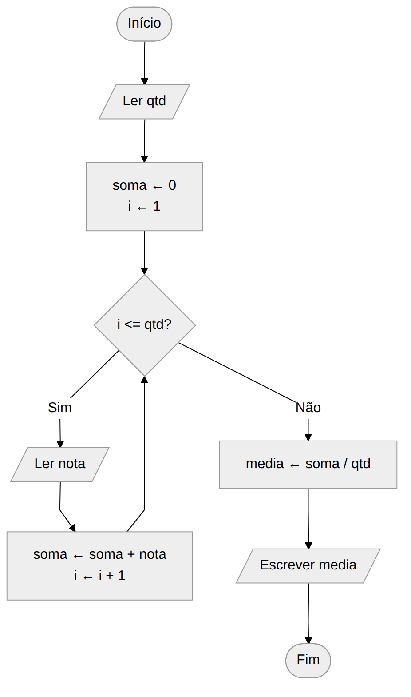

## Exercício 27 - Aprovados e reprovados

**Entradas:** nota dos 10 alunos

**Processamento:** Conta aprovados (nota >= 7) e reprovados. perc = aprovados * 100 / 10.

**Saídas:** Aprovados, reprovados e percentual

**Código:** [exercicio27.c](exercicio27.c)

**Fluxograma:**

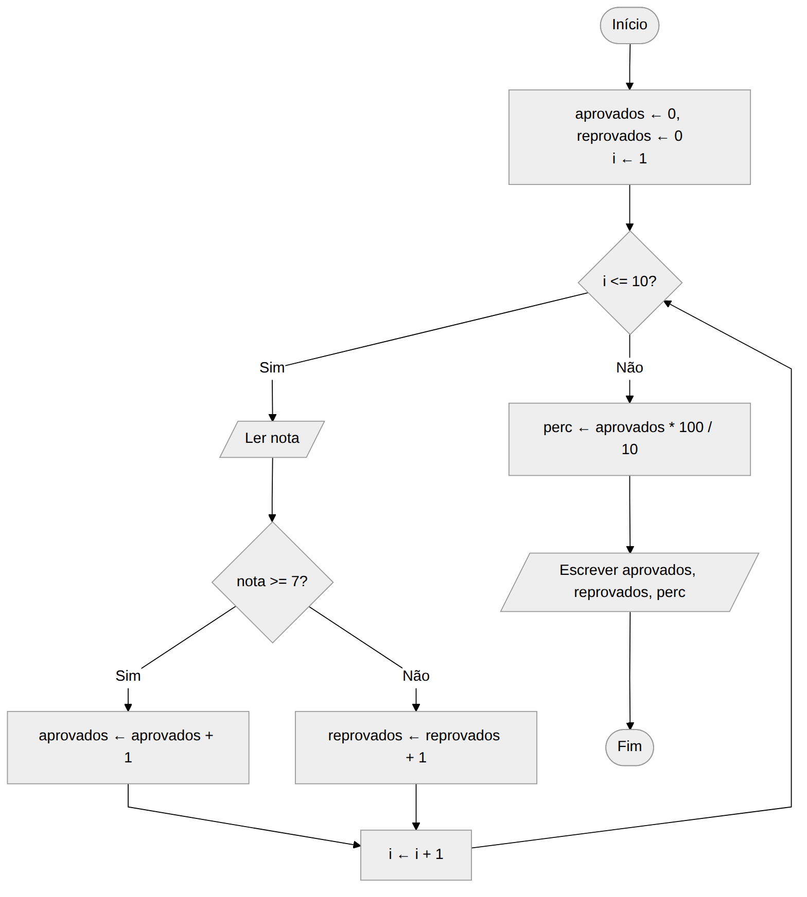

## Exercício 28 - Maior número

**Entradas:** 10 números

**Processamento:** O primeiro número vira o maior; os outros 9 são comparados no for.

**Saídas:** O maior número

**Código:** [exercicio28.c](exercicio28.c)

**Fluxograma:**

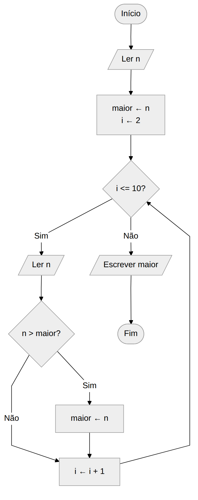

## Exercício 29 - Senha

**Entradas:** senha

**Processamento:** while (senha != 1234) pede de novo.

**Saídas:** "Senha incorreta..." e "Acesso autorizado."

**Código:** [exercicio29.c](exercicio29.c)

**Fluxograma:**

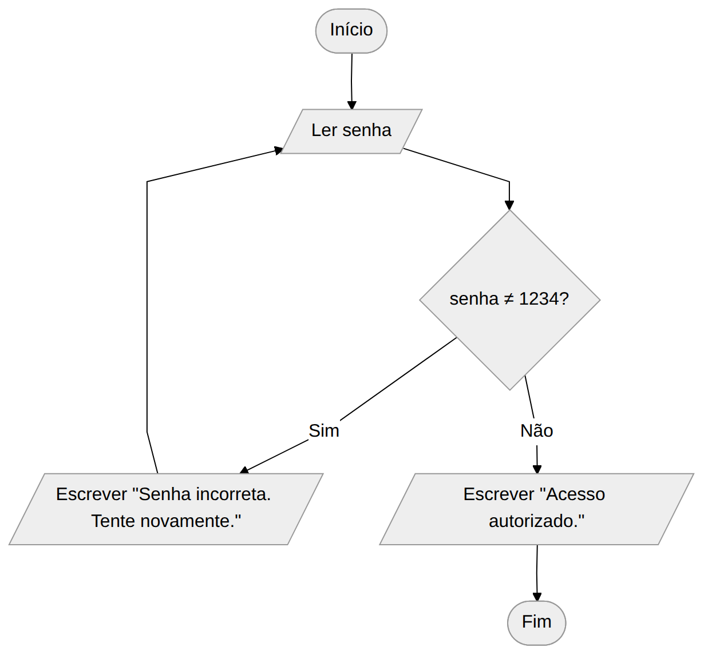

## Exercício 30 - Caixa eletrônico

**Entradas:** opcao, valor (saldo inicial R$ 1000)

**Processamento:** do while com o menu até a opção 4. switch para cada opção. No saque testa se tem saldo.

**Saídas:** Saldo, "Saldo insuficiente" ou saída

**Código:** [exercicio30.c](exercicio30.c)

**Fluxograma:**

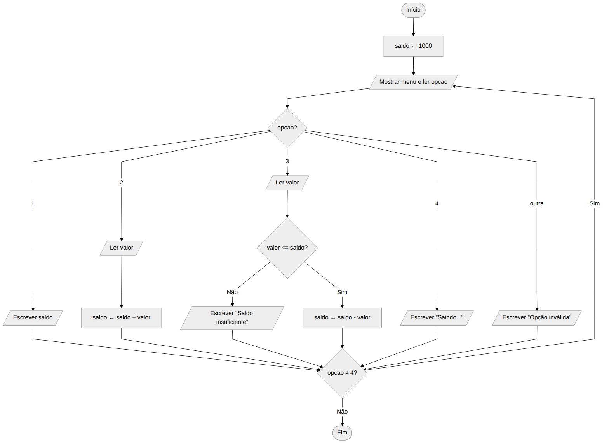

---

# Parte 4 - Desafios

## Exercício 31 - Posto de combustível

**Entradas:** litros, preco

**Processamento:** bruto = litros * preco. Menos de 20 L sem desconto, até 40 L 3%, mais de 40 L 5%.

**Saídas:** Valor bruto, desconto e valor final

**Código:** [exercicio31.c](exercicio31.c)

**Fluxograma:**

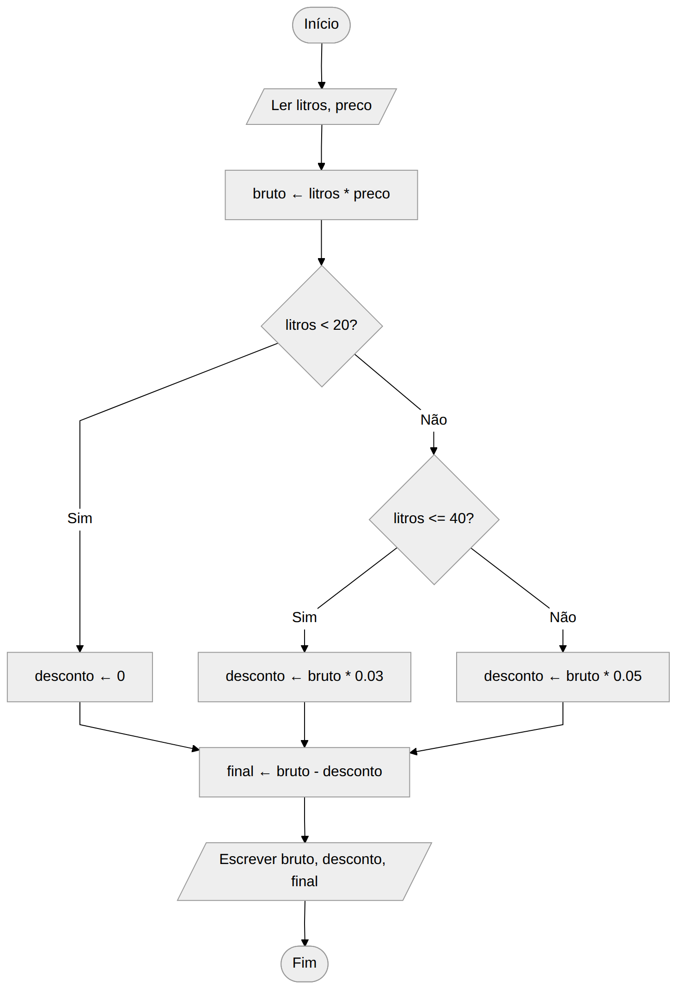

## Exercício 32 - Estacionamento

**Entradas:** entrada, saida (horas)

**Processamento:** horas = saida - entrada (se der negativo soma 24). Até 1 hora R$ 10, depois R$ 5 por hora.

**Saídas:** Tempo e valor

**Código:** [exercicio32.c](exercicio32.c)

**Fluxograma:**

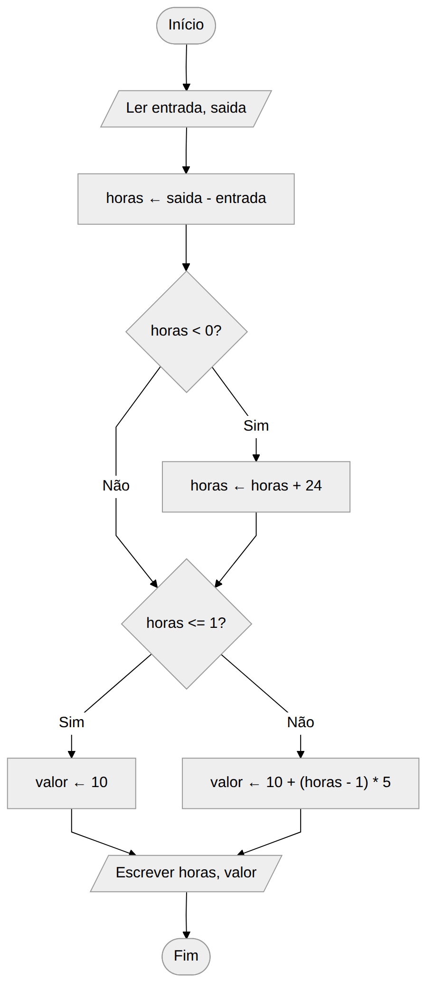

## Exercício 33 - Eleição

**Entradas:** voto (1, 2, 3 ou 0 para encerrar)

**Processamento:** do while até voto 0, somando no contador de cada candidato. Depois compara para achar o vencedor.

**Saídas:** Votos de cada um, total e vencedor

**Código:** [exercicio33.c](exercicio33.c)

**Fluxograma:**

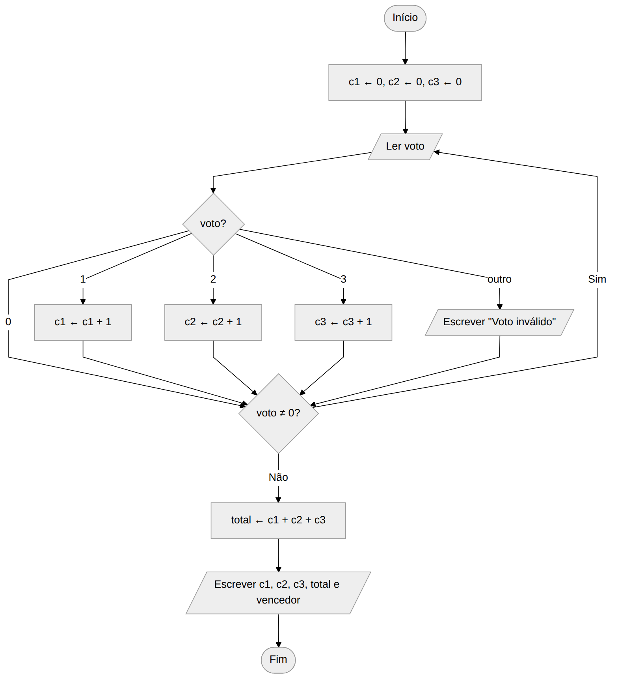

## Exercício 34 - Sistema de vendas

**Entradas:** produto, qtd, preco e continuar (1 ou 0)

**Processamento:** Para cada venda: totalVenda = qtd * preco, soma nos totais e guarda a maior venda. Repete enquanto continuar for 1.

**Saídas:** Vendas, produtos vendidos, faturamento e maior venda

**Código:** [exercicio34.c](exercicio34.c)

**Fluxograma:**

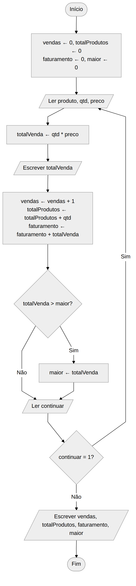

## Exercício 35 - Sistema acadêmico

**Entradas:** qtd e, para cada aluno, nome, n1, n2

**Processamento:** media = (n1 + n2) / 2 e classifica. Conta cada situação, soma as médias e guarda a maior e a menor.

**Saídas:** Situação de cada aluno e o resumo da turma

**Código:** [exercicio35.c](exercicio35.c)

**Fluxograma:**

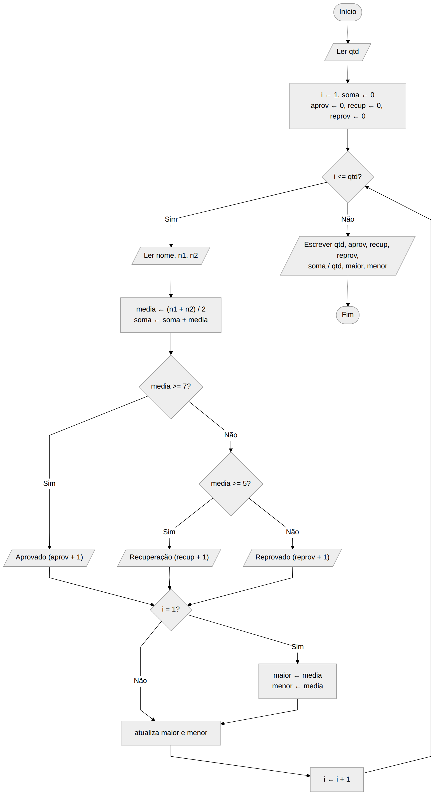

---

# Desafio Final - Pedidos de uma lanchonete

### 1. Descrição do problema

Na lanchonete o atendente precisa somar os pedidos, ver se tem desconto e calcular o troco. O programa mostra o cardápio, vai somando os itens até o cliente finalizar, dá 10% de desconto se o pedido for de R$ 50 ou mais e calcula o troco.

Cardápio: 1 - X-Burguer R$ 18 | 2 - X-Salada R$ 20 | 3 - Batata frita R$ 12 | 4 - Refrigerante R$ 6 | 5 - Suco R$ 8 | 0 - Finalizar

### 2. Entradas

- codigo do item (0 para finalizar)
- qtd (quantidade do item)
- pago (valor que o cliente deu)

### 3. Processamento

- Repete o cardápio até o código 0.
- Para cada item: total = total + preco * qtd e itens = itens + qtd.
- Se total >= 50, desconto = total * 0.10, senão desconto = 0.
- pagar = total - desconto
- Se pago >= pagar, troco = pago - pagar, senão o valor é insuficiente.

### 4. Saídas

Quantidade de itens, total, desconto, valor a pagar e troco.

### 5. Pseudocódigo

```
Algoritmo Lanchonete
Var
   codigo, qtd, itens: inteiro
   preco, total, desconto, pagar, pago: real
Inicio
   total <- 0
   itens <- 0
   Repita
      Escreva("1-X-Burguer 2-X-Salada 3-Batata 4-Refrigerante 5-Suco 0-Finalizar")
      Leia(codigo)
      Escolha codigo
         caso 1: preco <- 18
         caso 2: preco <- 20
         caso 3: preco <- 12
         caso 4: preco <- 6
         caso 5: preco <- 8
         outrocaso: preco <- 0
      FimEscolha
      Se preco > 0 entao
         Leia(qtd)
         total <- total + preco * qtd
         itens <- itens + qtd
      Senao
         Se codigo <> 0 entao
            Escreva("Codigo invalido")
         FimSe
      FimSe
   Ate codigo = 0
   Se total >= 50 entao
      desconto <- total * 0.10
   Senao
      desconto <- 0
   FimSe
   pagar <- total - desconto
   Escreva(itens, total, desconto, pagar)
   Leia(pago)
   Se pago >= pagar entao
      Escreva("Troco: ", pago - pagar)
   Senao
      Escreva("Valor insuficiente")
   FimSe
Fim
```

### 6. Fluxograma

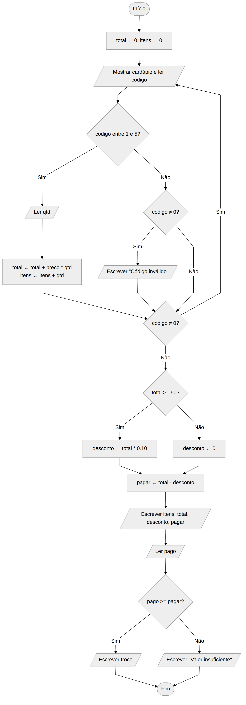

### 7. Teste de mesa

**Cenário 1 - sem desconto:** 2 X-Burguer e 2 refrigerantes, pagou R$ 50

| codigo | qtd | total | itens |
|---|---|---|---|
| 1 | 2 | 36 | 2 |
| 4 | 2 | 48 | 4 |
| 0 | - | 48 | 4 |

Total 48 é menor que 50, desconto 0, pagar 48. Troco: R$ 2,00

**Cenário 2 - com desconto:** 2 X-Salada, 1 batata e 1 suco, pagou R$ 100

| codigo | qtd | total | itens |
|---|---|---|---|
| 2 | 2 | 40 | 2 |
| 3 | 1 | 52 | 3 |
| 5 | 1 | 60 | 4 |
| 0 | - | 60 | 4 |

Total 60 é maior que 50, desconto 6, pagar 54. Troco: R$ 46,00

**Cenário 3 - código inválido e dinheiro insuficiente:** 1 batata, depois código 9, pagou R$ 10

| codigo | qtd | total | itens | saída |
|---|---|---|---|---|
| 3 | 1 | 12 | 1 | |
| 9 | - | 12 | 1 | Codigo invalido |
| 0 | - | 12 | 1 | |

Pagar 12, pagou 10: Valor insuficiente

### 8. Explicação

Usei um do while para o cardápio ficar repetindo até o cliente digitar 0, e um switch para pegar o preço de cada item. As variáveis total e itens começam em zero e vão somando a cada pedido. No final um if vê se tem desconto e outro if vê se o dinheiro dá para pagar.
